# A. Eyongtarh Besong --- Portfolio

A modern, responsive, and interactive portfolio website showcasing my skills, experience, education, and projects as a **Full Stack Software Developer**. Built with **React**, **Vite**, and **Framer Motion**, the website emphasises performance, accessibility, and clean user experience with a premium glassmorphism-inspired design.

[](#)
[](#)
[](#)

---

**Deployed website: [Link to website](https://eyongtarh-portfolio.vercel.app/)**


---

## Features

- Responsive design for desktop, tablet, and mobile
- Smooth animations with Framer Motion
- GitHub API integration for project data
- Project filtering by category
- Downloadable CV
- Modern, reusable React components
- Clean and maintainable code structure
- Smooth scrolling navigation
- Animated hero section
- Glassmorphism UI elements
- Interactive project showcase
- Skills section with technology icons
- Experience timeline
- Education timeline
- Interests section
- Contact section
- Social media integration
- Active navigation highlighting
- Mobile-friendly navigation menu
- Scroll animations using Framer Motion
- Optimised images and performance
- Accessibility best practices

---

## Tech Stack

### Frontend

- React 19
- Vite
- JavaScript (ES6+)
- HTML5
- CSS3
- Framer Motion
- Font Awesome

### Backend Experience

Although this portfolio is frontend-based, my primary backend technologies include:

- Django
- Django REST Framework
- PostgreSQL
- SQLite

### Development Tools

- Git
- GitHub
- VSCode
- npm

---

## Project Structure

```text
eyongtarh-portfolio/
├── .vscode/
├── dist/
├── node_modules/
│
├── public/
│   ├── errors/
│   ├── images/
│   │   └── projects/
│   │       ├── ekpaw.png
│   │       ├── hero.png
│   │       ├── portfolio.png
│   │       ├── riders.png
│   │       └── tastyhub.png
│   ├── 404.html
│   ├── cv.pdf
│   ├── favicon.ico
│   ├── humans.txt
│   ├── logo.png
│   ├── og-image.png
│   ├── profile.jpeg
│   ├── robots.txt
│   ├── security.txt
│   ├── site.webmanifest
│   └── sitemap.xml
│
├── src/
│   ├── assets/
│   │   ├── errors/
│   │   │   ├── 404.png
│   │   │   ├── access-denied.png
│   │   │   ├── error.png
│   │   │   ├── loading-error.png
│   │   │   └── maintenance.png
│   │   │
│   │   ├── icons/
│   │   │
│   │   ├── images/
│   │   │   └── hero-bg.svg
│   │   │
│   │   └── styles/
│   │       ├── animations.css
│   │       ├── globals.css
│   │       ├── reset.css
│   │       ├── typography.css
│   │       └── variables.css
│   │
│   ├── components/
│   │   ├── About/
│   │   ├── AnimatedBackground/
│   │   ├── Contact/
│   │   ├── CursorGlow/
│   │   ├── Education/
│   │   ├── Experience/
│   │   ├── Footer/
│   │   ├── Hero/
│   │   ├── Interests/
│   │   ├── LoadingScreen/
│   │   ├── Navbar/
│   │   ├── Projects/
│   │   ├── ScrollProgress/
│   │   ├── Skills/
│   │   ├── ErrorBoundary.jsx
│   │   ├── ErrorIllustration.jsx
│   │   ├── ErrorLayout.css
│   │   └── ErrorLayout.jsx
│   │
│   ├── data/
│   ├── hooks/
│   ├── pages/
│   ├── utils/
│   ├── App.css
│   ├── App.jsx
│   └── main.jsx
│
├── .env
├── .gitignore
├── eslint.config.js
├── index.html
├── mythings.md
├── package.json
├── package-lock.json
├── postcss.config.js
├── README.md
└── vite.config.js
```

---

## Featured Projects

- **Ekpaw Spicies** -- Python business automation with Google Sheets
  integration.
- **Riders Club** -- Full-stack Django application for a
  motorcycle/bicycle club.
- **Tarh TastyHub** -- Restaurant and food ordering platform with
  Stripe payments.

---

## Website Sections

### Home

A welcoming hero section introducing who I am, along with social links and quick navigation.


### About

It contains an overview of my background, passion for software development, and career goals.


### Skills & Technologies

This section is made up of a collection of technologies, programming languages, frameworks, and tools I use.

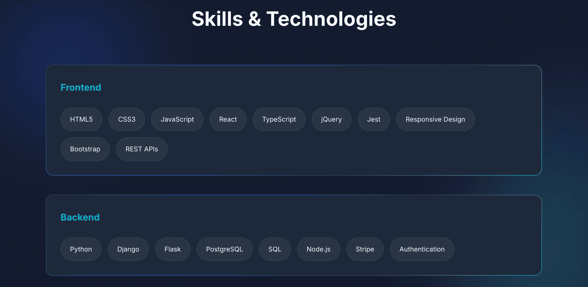
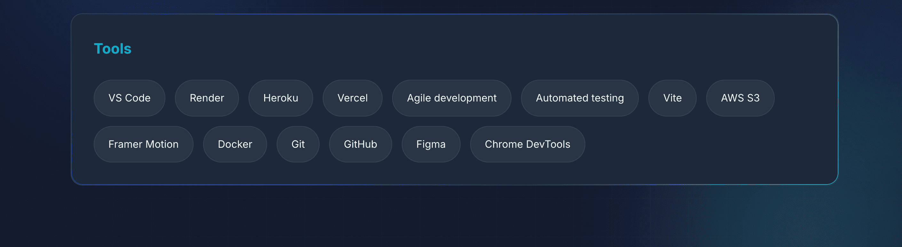

### Professional Experience

This section presents my professional and practical experience highlighting responsibilities and achievements.

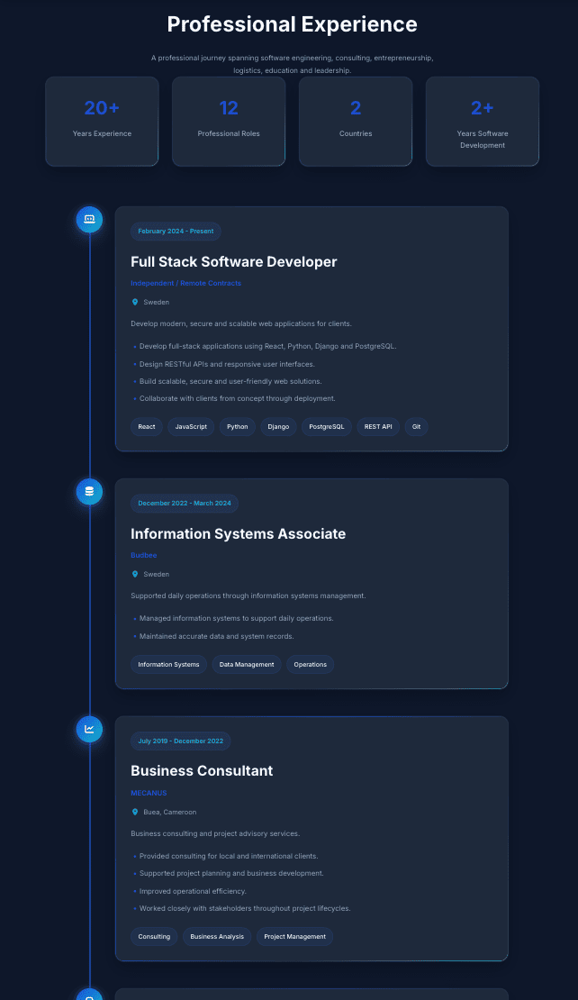

### Education

Academic background, certifications, and continuous learning journey.

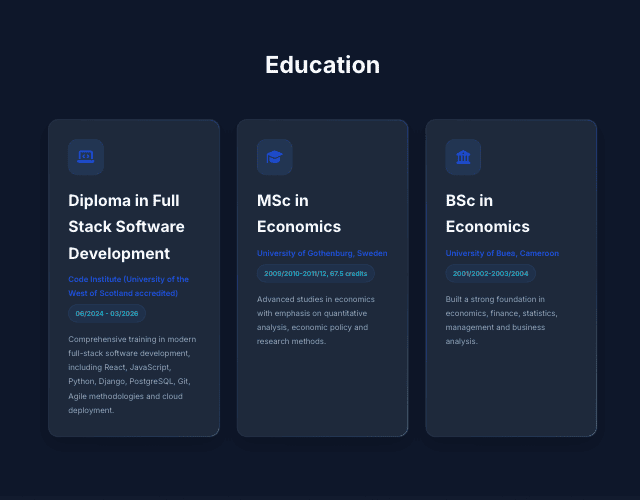

### Featured Projects

A showcase of selected software development projects demonstrating practical experience.

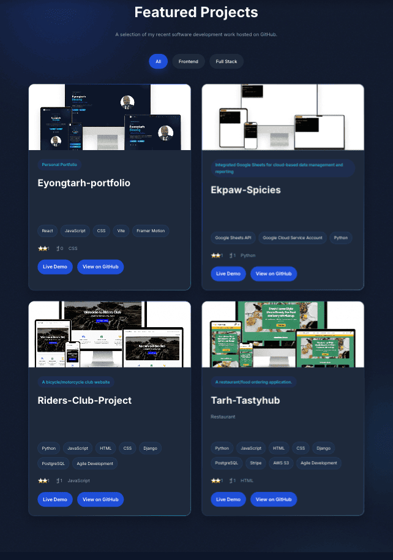

### Interests

Personal interests that complement my professional growth and creativity.

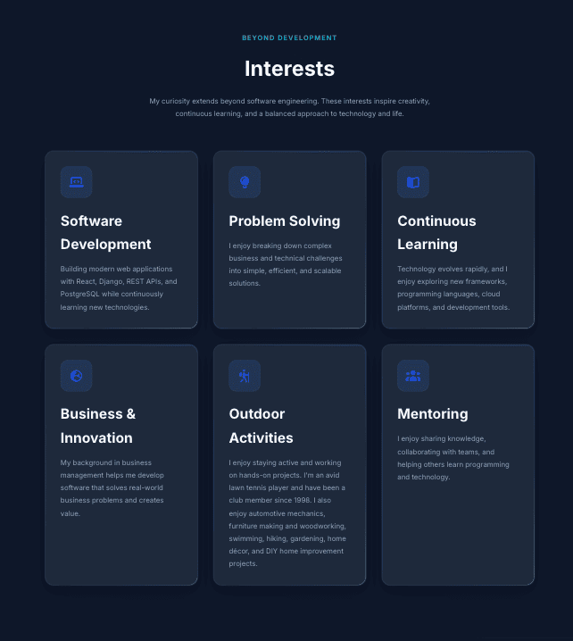

### Contact

Multiple ways to connect through email and professional social platforms.

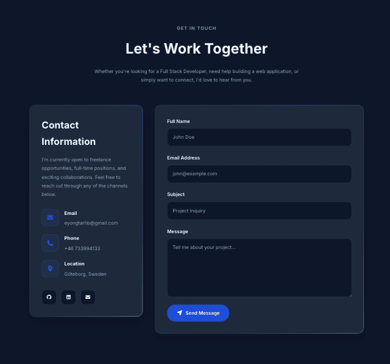

### Footer

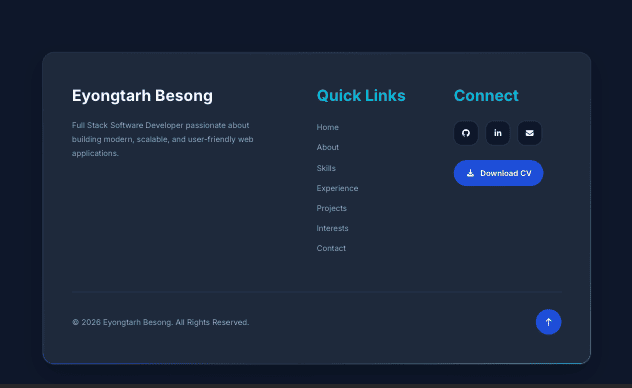

---

## Testing

### JS Validation:

No errors or warning messages were found when passing through the official [JSHint](https://www.jshint.com/) validator. However, to validate js full, `/* jshint esversion: 11 */ and or /* global bootstrap */ and or /* global Stripe */` was added to the top of the file.

### Responsiveness

The responsiveness was checked manually by using devtools (Chrome) throughout the whole development. [Responsive Viewer](https://chrome.google.com/webstore/detail/responsive-viewer/inmopeiepgfljkpkidclfgbgbmfcennb/related?hl=en) Chrome extension.

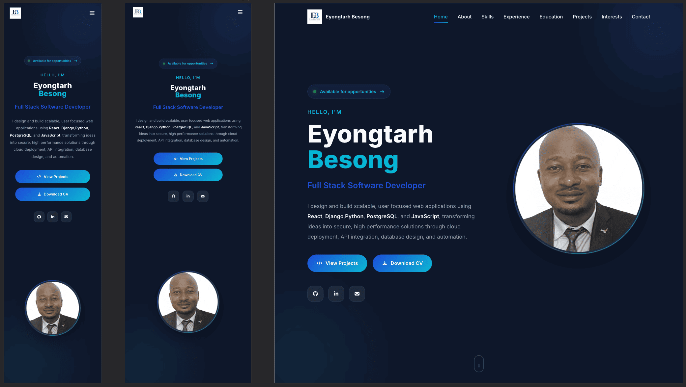

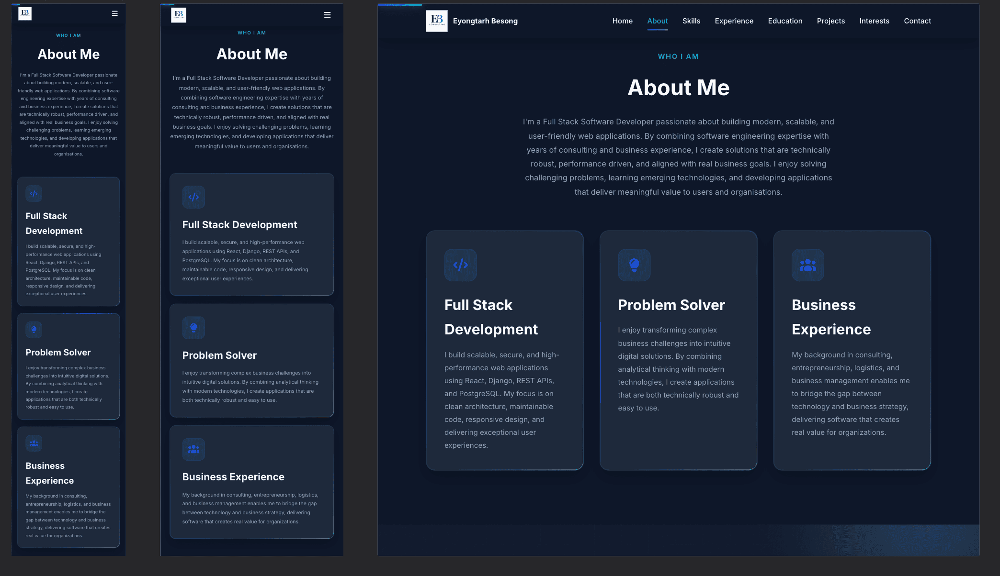

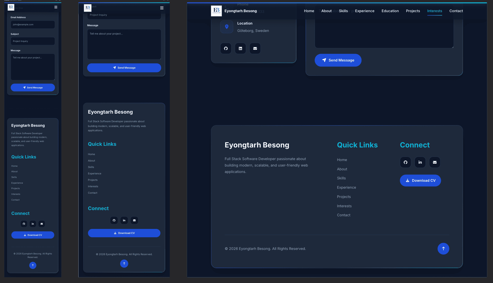

### Compatibility

Testing was conducted on the following browsers;

- Safari;


- Chrome;


- Firefox;


### Lighthouse Report

LightHouse is a web performance testing tool that can be used to evaluate the performance of a website. The report is generated by Google Chrome.

- 

### CSS Validation:

No errors or warnings were found when passing through the official [W3C (Jigsaw)](https://jigsaw.w3.org/css-validator/#validate_by_uri) validator. The css code works perfectly on various devices.


### HTML Validation:

No errors or warnings were found when passing through the official [W3C](https://validator.w3.org/) validator. This checking was done manually by copying the view page source code and pasting it into the validator.

- 

---

## About Me

I'm a Full Stack Developer with experience building responsive web
applications using React, Django, PostgreSQL, and JavaScript. I enjoy
creating software that combines clean engineering with practical
business value.

---

## Contact

- GitHub: https://github.com/Eyongtarh
- LinkedIn: Add your LinkedIn URL
- Email: Add your email address

---

## Support

If you found this project helpful, consider giving the repository a ⭐ on GitHub.

---

Built with ❤️ by **Eyongtarh Besong**

```

```
