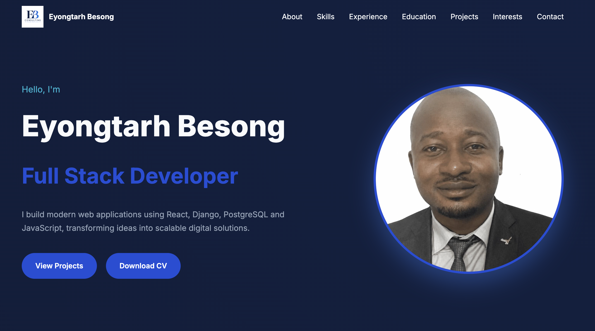

# A. Eyongtarh Besong --- Portfolio

---

**Deployed website: [Link to website](https://eyongtarh-portfolio.vercel.app/)**



---

[](#)
[](#)
[](#)

A modern, responsive portfolio built with **React**, **Vite**, and
**Framer Motion**. It showcases my background as a Full Stack Developer,
highlights selected GitHub projects, and demonstrates clean UI design
and component-based architecture.

---

## Features

- Responsive design for desktop, tablet, and mobile
- Smooth animations with Framer Motion
- GitHub API integration for project data
- Project filtering by category
- Downloadable CV
- Modern, reusable React components
- Clean and maintainable code structure

---

## Tech Stack

**Frontend**

- React
- Vite
- JavaScript (ES6+)
- CSS3
- Framer Motion

**APIs & Tools**

- GitHub REST API
- Git
- GitHub

---

## 📂 Project Structure

```text
src/
├── components/
├── hooks/
├── data/
├── assets/
└── App.jsx

public/
├── logo.png
├── profile.png
└── cv.pdf
```

---

## 🚀 Getting Started

### Clone the repository

```bash
git clone https://github.com/Eyongtarh/eyongtarh-portfolio.git
cd eyongtarh-portfolio
```

### Install dependencies

```bash
npm install
```

### Run locally

```bash
npm run dev
```

### Build

```bash
npm run build
```

### Preview production build

```bash
npm run preview
```

---

## 🔗 GitHub Integration

The portfolio retrieves repositories using the GitHub REST API.

Update the username in:

```js
const USERNAME = "Eyongtarh";
```

Featured repositories are configured in:

```text
src/data/projects.js
```

Each featured project should include:

```js
{
  github: "Repository-Name",
  featured: true,
  order: 1,
  image: "/images/projects/project.png",
  demo: "https://example.com",
  category: "Full Stack",
  highlight: "Short description",
  technologies: ["React", "Django"]
}
```

---

## 🌟 Featured Projects

- **Ekpaw Spicies** -- Python business automation with Google Sheets
  integration.
- **Riders Club** -- Full-stack Django application for a
  motorcycle/bicycle club.
- **Tarh TastyHub** -- Restaurant and food ordering platform with
  Stripe payments.

---

## 📸 Screenshots

Add screenshots here after deployment.

```text
docs/
├── home.png
├── projects.png
└── contact.png
```

---

## 🌍 Live Demo

Add your deployed portfolio URL here:

```text
https://your-domain.com
```

---

## 👨‍💻 About Me

I'm a Full Stack Developer with experience building responsive web
applications using React, Django, PostgreSQL, and JavaScript. I enjoy
creating software that combines clean engineering with practical
business value.

---

## 📫 Contact

- GitHub: https://github.com/Eyongtarh
- LinkedIn: Add your LinkedIn URL
- Email: Add your email address

---

## 📄 License

This project is licensed under the EB License.
